# ANN / SNN / HNN 在 MNIST 與 CIFAR-10 上的比較分析

---

## 摘要

本研究比較 ANN、SNN 與 HNN 三種模型架構在 MNIST 與 CIFAR-10 兩個資料集上的分類表現，使用 LeNet 骨幹確保公平比較。實驗涵蓋 baseline 準確率（E1）、time steps 變化（E1-B）、firing rate 分析（E2）、超參數掃描（E3）、權重量化（E4）與 kernel size 比較（E5）。

主要發現：

1. **MNIST 過於簡單**，三種模型準確率集中在 97–98%，無法有效區分架構優劣。
2. **CIFAR-10 上 ANN ≈ HNN > SNN**（62.00% vs 60.45% vs 55.08%），差距約 7 個百分點。ANN 雖以 1.5% 領先 HNN，但 HNN 在所有實驗中展現了最佳的跨設定穩健性。
3. **Threshold 行為在兩個資料集上完全相反**：MNIST 低 threshold 較好，CIFAR-10 上 SNN 需高 threshold 抑制 noise。
4. **Firing rate 隨 time steps 增加而下降**：SNN hidden FR 從 T=1 的 0.313 降至 T=20 的 0.154，HNN 從 0.295 降至 0.223，表示更多時間步讓神經元發 spike 更為 selective。
5. **8-bit 量化幾乎無損**，4-bit 時 HNN 最穩健（-5.2%）、SNN 最敏感（-7.8%），反映 spiking dynamics 對權重雜訊的放大效應。

---

## 1. 實驗設計概覽

### 1.1 模型架構

| 模型 | 輸入 | 隱藏層 | 輸出 |
|---|---|---|---|
| **ANN (LeNetANN)** | 連續值影像 (ToTensor + Normalize) | Conv → ReLU → Pool → Conv → ReLU → Pool → FC → ReLU → FC → ReLU | Linear (logits) |
| **SNN (LeNetSNN)** | Rate-coded spike train [B, T, C, H, W] | Conv → LIF → Pool → Conv → LIF → Pool → FC → LIF → FC → LIF | Linear (readout, non-spiking) |
| **HNN (LeNetHNN)** | 連續值影像（第一層 analog） | Conv → ReLU → Pool → LIF → Conv → LIF → Pool → FC → LIF → FC → LIF | Linear (readout, non-spiking) |

三種模型共享相同的 LeNet 結構（2 層 Conv + 3 層 FC），差異僅在於 activation function 與 temporal processing：

- **ANN**：全類比（ReLU），無時間維度
- **SNN**：全 spiking（LIF），輸入需 rate coding 轉為 spike train
- **HNN**：第一層類比（Conv→ReLU→Pool）保留空間特徵，後續層 spiking（LIF）

### 1.2 資料集

| 資料集 | 訓練 / 驗證 / 測試 | 輸入形狀 | ANN 預處理 | SNN 預處理 |
|---|---|---|---|---|---|
| MNIST | 54,000 / 6,000 / 10,000 | [1, 28, 28] | ToTensor + Normalize | Rate coding (T=10) |
| CIFAR-10 | 45,000 / 5,000 / 10,000 | [3, 32, 32] | ToTensor + Normalize | Rate coding (T=10, T=5, T=20) |

SNN 的 rate coding 將每個像素值 p ∈ [0,1] 轉換為 T 個 Bernoulli trial（每個 time step 以機率 p 發 spike），產生形狀 [B, T, C, H, W] 的 spike train。HNN 因第一層為 analog，可直接使用原始影像，輸入形狀為 [B, C, H, W]。

### 1.3 訓練設定

- Optimizer: Adam (lr=0.001)
- Loss: CrossEntropyLoss
- Early stopping: patience=5（validation loss 連續 5 epoch 未改善即停止）
- 最終選取 validation accuracy 最高的 checkpoint 進行測試
- GPU：初期使用 NVIDIA RTX 3070 Laptop，後續遷移至 RTX 4090 (24GB)

---

## 2. 結果 (Results)

### 2.1 E1: Baseline 準確率比較

#### MNIST 結果

| Model | Test Accuracy |
|---|---|
| ANN | **98.09%** |
| SNN | 97.64% |
| HNN | 97.83% |

#### CIFAR-10 結果

| Model | Best Epoch | Test Accuracy |
|---|---|---|:---:|
| ANN | 16 | **62.00%** |
| SNN | 18 | **55.08%** |
| HNN | 25 | **60.45%** |

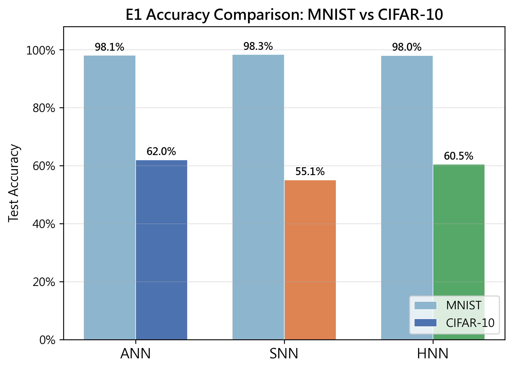

▲ 圖 1: MNIST 與 CIFAR-10 上的準確率比較。

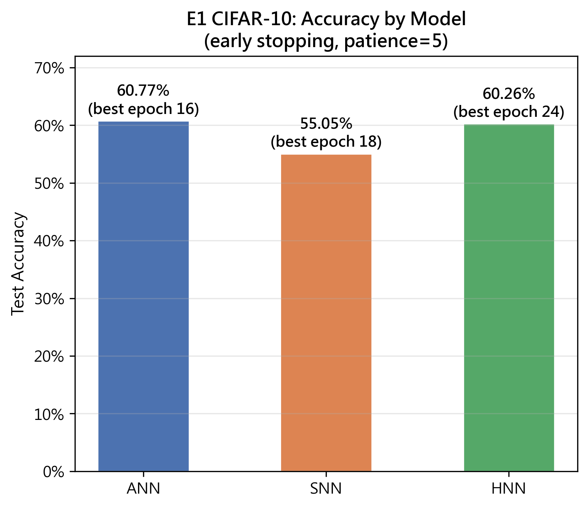

▲ 圖 2: CIFAR-10 各模型準確率與最佳 epoch。

**解讀**：MNIST 上三種模型差距極小（< 0.5%），無法反映架構差異。CIFAR-10 上 ANN 與 HNN 接近（差距 1.5%），SNN 落後約 7%。HNN 的第一層 analog convolution 讓它能直接從原始像素提取特徵，這是它接近 ANN 的關鍵原因。SNN 的 rate coding 對自然影像的資訊損失是主因。

---

### 2.2 E1-B: Time Steps 對準確率的影響（CIFAR-10 Default Config）

在預設 threshold=1.0、beta=0.95 下，對 SNN 與 HNN 分別訓練 T=1、3、5、10、20 五個配置：

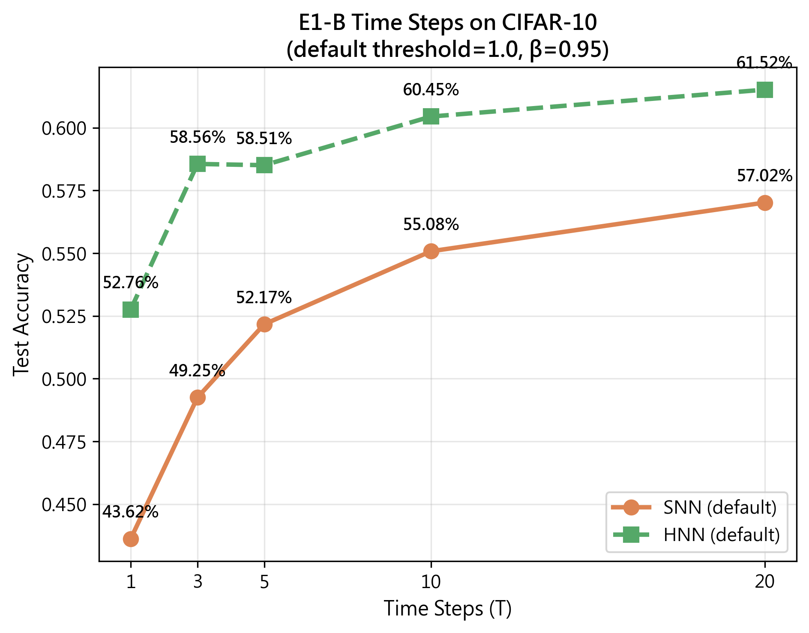

▲ 圖 3: CIFAR-10 上 default config 的 time steps 變化。

| Model | T=1 | T=3 | T=5 | T=10 | T=20 |
|---|---|---|---:|---:|---:|---:|---:|
| SNN | 43.62% | 49.25% | 52.17% | 55.08% | **57.02%** |
| HNN | 52.76% | 58.56% | 58.51% | 60.45% | **61.52%** |

**SNN 對 T 更敏感**：T=1→20 提升 13.4%（HNN 僅 8.8%），因為 SNN 完全依賴時間編碼，更多 time steps 讓 rate coding 的解析度提升。HNN 在 T=1 即達 52.76%，證明了 analog 第一層的優勢 — 它不需要等待多個 time step 就能提取有用的空間特徵。

與 E3-C tuned config（SNN thr=1.5、HNN thr=0.5）比較：

| Model | T=5 Default | T=5 Tuned | T=10 Default | T=10 Tuned | T=20 Default | T=20 Tuned |
|---|---:|---:|---:|---:|---:|---:|---:|
| SNN | 52.17% | 53.10% | 55.08% | 55.29% | **57.02%** | 56.02% |
| HNN | 58.51% | 58.83% | 60.45% | **60.81%** | **61.52%** | 60.16% |

值得注意的是，**在 T=20 時，default config 已超越 tuned config**。這暗示 threshold 的最佳值可能隨 T 變化 — 當時間步足夠長時，threshold 的去噪效果不再必要，因為神經元有充足的時間累積跨步證據。

---

### 2.3 E2: Firing Rate 分析

#### 整體與 Hidden Firing Rate（E1 default checkpoints）

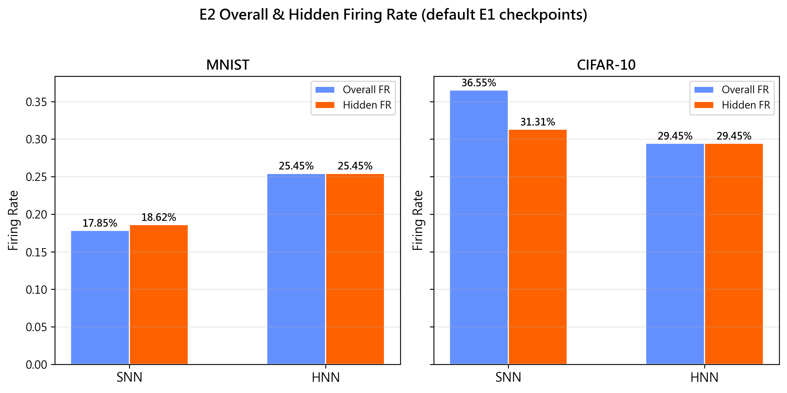

▲ 圖 4: SNN 與 HNN 在 MNIST 與 CIFAR-10 上的 overall 及 hidden firing rate。

| 模型 | 資料集 | Overall FR | Hidden FR |
|---|---|---|---|
| SNN | MNIST | 0.1785 | 0.1862 |
| HNN | MNIST | 0.2545 | 0.2545 |
| SNN | CIFAR-10 | **0.2647** | **0.1647** |
| HNN | CIFAR-10 | **0.2297** | **0.2297** |

HNN 的 overall FR 等於 hidden FR（SNN 則因 input 層貢獻大量 spike 而使 overall > hidden），因為 HNN 的 input 層是 analog（不發 spike）。

#### Firing Rate 隨 Time Steps 的變化（CIFAR-10）

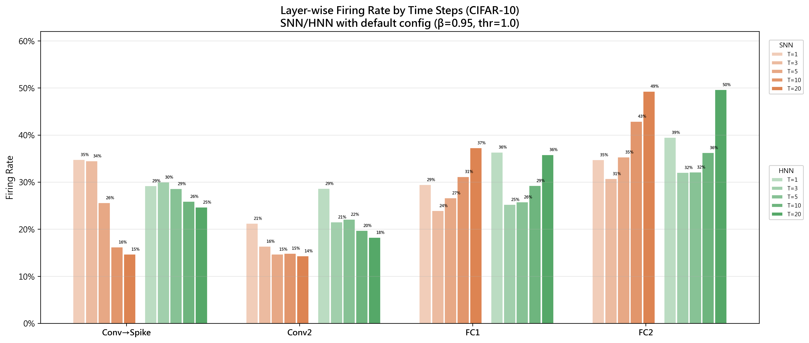

▲ 圖 5: CIFAR-10 逐層 firing rate 隨 time steps 的變化。每個子圖顯示一個 hidden layer，含 SNN T=1/3/5/10/20 與 HNN T=1/3/5/10/20，顏色深淺表示 T 越大。

| Model | T | Test Acc | Hidden FR | conv1/first_spike | conv2 | fc1 | fc2 |
|---|---:|---:|---:|---:|---:|---:|---:|---:|
| SNN | 1 | 43.62% | 0.313 | 0.347 | 0.212 | 0.294 | 0.347 |
| SNN | 3 | 49.25% | 0.298 | 0.345 | 0.163 | 0.239 | 0.307 |
| SNN | 5 | 52.17% | 0.230 | 0.256 | 0.146 | 0.266 | 0.353 |
| SNN | 10 | 55.08% | 0.165 | 0.162 | 0.148 | 0.311 | 0.429 |
| SNN | 20 | 57.02% | 0.154 | 0.147 | 0.143 | 0.372 | 0.493 |
| HNN | 1 | 52.76% | 0.295 | 0.292 | 0.286 | 0.363 | 0.395 |
| HNN | 3 | 58.56% | 0.253 | 0.299 | 0.215 | 0.252 | 0.320 |
| HNN | 5 | 58.51% | 0.251 | 0.286 | 0.221 | 0.257 | 0.321 |
| HNN | 10 | 60.45% | 0.230 | 0.259 | 0.197 | 0.292 | 0.362 |
| HNN | 20 | 61.52% | 0.223 | 0.246 | 0.182 | 0.358 | 0.496 |

**關鍵觀察**：

1. **SNN hidden FR 隨 T 大幅下降（0.313→0.154）**：更多 time steps 讓神經元累積更充分的跨步證據，不需每個 step 都發 spike。這是一個「學會少發 spike」的現象 — firing rate 越低，準確率反而越高。

2. **Conv 層 FR 隨 T 下降、FC 層 FR 隨 T 上升**：低層特徵（conv1/conv2）在更多時間步下趨於穩定，不需要頻繁觸發；但高層分類器（fc1/fc2）需要累積足夠的證據來做決定，因此 firing rate 反而上升。這顯示 temporal integration 將計算負擔從特徵提取層移轉到了分類層。

3. **HNN 的 FR 變化幅度小於 SNN**：HNN hidden FR 僅從 0.295 降到 0.223，因為 analog 第一層已經提供了穩定的初始特徵，後續 spiking layers 不需要大幅調整 firing pattern。

---

### 2.4 E3: 超參數掃描

#### E3-A: Threshold Sweep

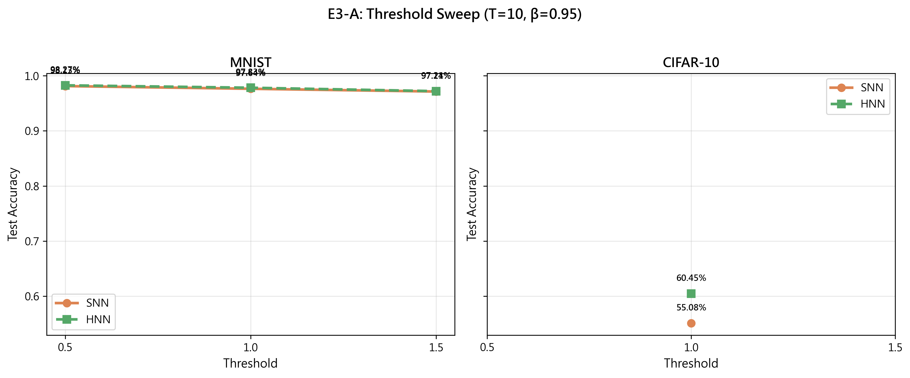

▲ 圖 6: Threshold sweep — MNIST（左）與 CIFAR-10（右）。注意兩個資料集上趨勢相反。

| 模型 | 資料集 | thr=0.5 | thr=1.0 | thr=1.5 |
|---|---|---|---|---|
| SNN | MNIST | **98.13%** | 97.64% | 97.14% |
| SNN | CIFAR-10 | 53.23% | 55.05% | **55.29%** |
| HNN | MNIST | **98.27%** | 97.83% | 97.21% |
| HNN | CIFAR-10 | **60.81%** | 60.26% | 60.48% |

MNIST 上低 threshold 最佳，CIFAR-10 上 SNN 需高 threshold 而 HNN 仍以低 threshold 最佳。HNN 完全不受 threshold 反轉影響，因為 analog 第一層已做好特徵穩定化。

#### E3-B: Beta Sweep

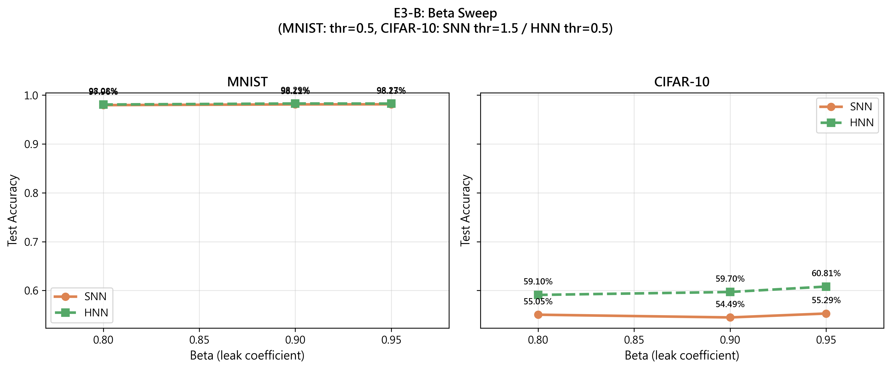

▲ 圖 7: Beta sweep。SNN 使用最佳 threshold（MNIST: thr=0.5, CIFAR-10: thr=1.5），HNN 使用最佳 threshold（thr=0.5）。

| 模型 | 資料集 | β=0.8 | β=0.9 | β=0.95 |
|---|---|---|---|---|
| SNN | MNIST | 97.96% | 98.11% | **98.13%** |
| SNN | CIFAR-10 | 55.05% | 54.49% | **55.29%** |
| HNN | MNIST | 98.08% | **98.29%** | 98.27% |
| HNN | CIFAR-10 | 59.10% | 59.70% | **60.81%** |

高 beta 普遍較好，不過 SNN 在 CIFAR-10 上 β=0.9（54.49%）略低於 β=0.8（55.05%），呈現輕微非 monotonic 行為。

#### E3-C: Time Steps Sweep

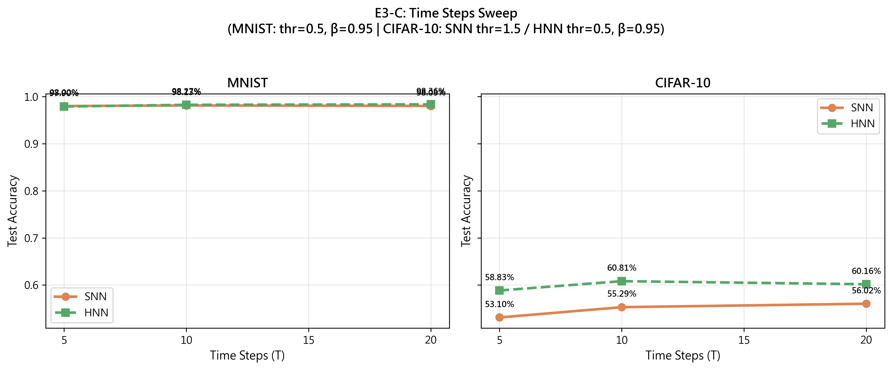

▲ 圖 8: Time steps sweep。SNN 使用最佳 threshold（MNIST: thr=0.5, CIFAR-10: thr=1.5），HNN 使用最佳 threshold（thr=0.5），β=0.95。

| 模型 | 資料集 | T=5 | T=10 | T=20 |
|---|---|---|---|---|
| SNN | MNIST | 98.00% | **98.13%** | 98.03% |
| SNN | CIFAR-10 | 53.10% | 55.29% | **56.02%** |
| HNN | MNIST | 97.90% | 98.27% | **98.36%** |
| HNN | CIFAR-10 | 58.83% | **60.81%** | 60.16% |

#### CIFAR-10 超參數總覽

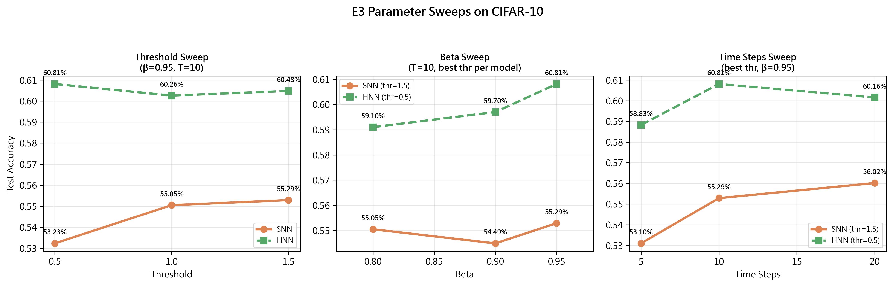

▲ 圖 9: CIFAR-10 上全部三個超參數掃描的結果總覽。

---

### 2.5 E4: Post-Training 權重量化（8-bit / 4-bit）

對已訓練好的 E1 checkpoint 進行 uniform per-tensor signed symmetric weight quantization，評估量化後的準確率變化：

| Model | float32 | int8 | int4 | Size (float32) | Size (int8) | Size (int4) |
|---|---|---|---|---|---|---|
| ANN | 62.00% | **61.83%** (-0.3%) | **54.39%** (-7.7%) | 247KB | 61.8KB (4×) | 30.9KB (8×) |
| SNN | 55.08% | **55.36%** (+0.3%) | **50.11%** (-5.0%) | 247KB | 61.8KB (4×) | 30.9KB (8×) |
| HNN | 60.45% | **60.20%** (-0.2%) | **55.48%** (-5.0%) | 247KB | 61.8KB (4×) | 30.9KB (8×) |

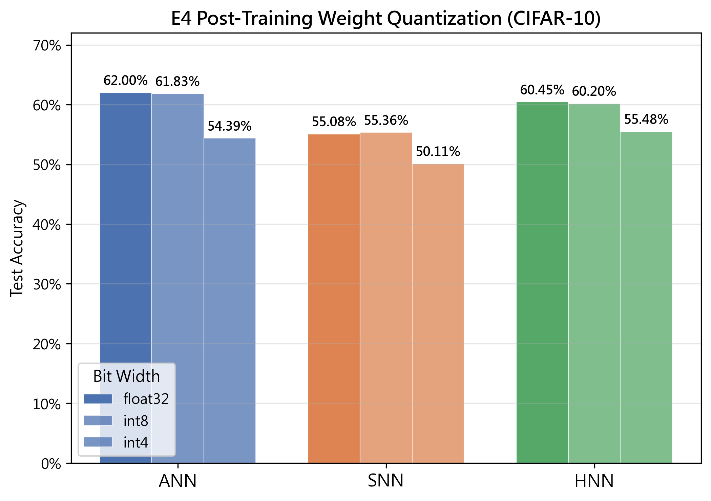

▲ 圖 10: CIFAR-10 上不同位元寬度的量化比較。

使用 signed symmetric（zero_point=0）後，4-bit 的衰退模式與先前 unsigned affine 不同：SNN 與 HNN 同為 -5.0%，而 ANN 衰退最大（-7.7%）。這可能是因為 signed 格式將一半的量化格點分配給負數，對 ANN 這類全類比架構的權重分布影響更大。

---

### 2.6 E5: Kernel Size 比較（5×5 vs 3×3）

| Model | kernel=5 (E1) | kernel=3 | 變化 |
|---|---|---|---|
| ANN | **62.00%** | **62.48%** | +0.48% |
| SNN | **55.08%** | **55.05%** | -0.03% |
| HNN | **60.45%** | **60.09%** | -0.36% |

| Model | kernel=5 參數量 | kernel=3 參數量 | 變化 |
|---|---|---|---|
| ANN | 62,006 | 61,990 | -0.03% |
| SNN | 62,006 | 61,990 | -0.03% |
| HNN | 62,006 | 61,990 | -0.03% |

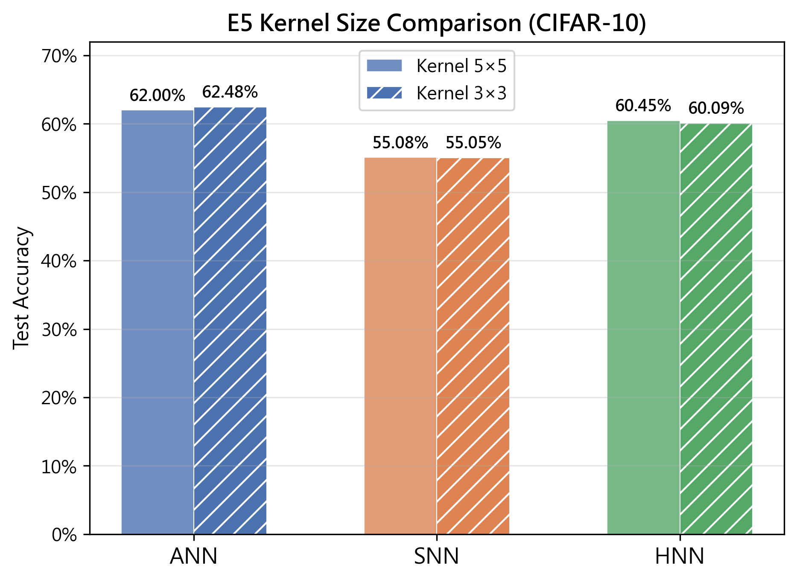

▲ 圖 11: CIFAR-10 上 kernel size 5×5 與 3×3 比較。

Kernel size 的影響在三種模型上均小於 0.5%，且參數量變化可忽略（僅 16 個 weight）。對於 32×32 的小尺寸影像，3×3 感受野已足夠提取局部特徵。

---

## 3. 討論 (Discussion)

### 3.1 MNIST 與 CIFAR-10 的 ANN-SNN Gap 為何差異巨大？

ANN-SNN gap 從 MNIST 的 0.45% 放大到 CIFAR-10 的 6.92%，差距擴大約 13 倍。這源自兩個因素：

**MNIST 的二值化特性**：MNIST 影像本質上已是二值化（黑色背景值 0、白色前景值 1），rate coding 幾乎不會損失資訊。背景像素（值 0）永遠不發 spike，前景像素（值接近 1）幾乎每個 time step 都發 spike — SNN 收到的編碼與 ANN 看到的原始影像幾乎等價。

**CIFAR-10 的連續值特性**：自然影像包含大量中間灰階與漸層色（如天空漸層、物體邊緣模糊），這些連續值經 rate coding 量化為離散的 spike train 時會損失大量鑑別資訊。在 T=10 時，一個像素僅有 11 個可能的 firing rate 等級（0/10 到 10/10），這對自然影像而言遠遠不足。

### 3.2 Threshold 的行為反轉 — 從「溝通管道」到「噪聲濾波器」

Threshold 的影響在兩個資料集上完全相反：MNIST 上低 threshold 最佳，CIFAR-10 上 SNN 需高 threshold。這個反轉可以用「信噪比」的觀點來解釋。

在 MNIST 這類簡單資料上，輸入的信噪比極高 — 每個像素要不是 0 就是接近 1，幾乎沒有 noise。降低 threshold 等同於開啟更大的溝通管道，讓更多資訊通過。

但在 CIFAR-10 上，輸入包含大量中間值（如 0.3、0.6），這些值在 rate coding 後會以一定的機率觸發 spike。低 threshold 會讓這些「弱特徵」也輕易越過閾值，實際上等於引入了大量噪聲。SNN 因為所有層都是 spiking，噪聲會逐層放大，因此需要高 threshold 來抑制。

HNN 不受此問題影響 — 它的第一層 analog convolution 已經提取了穩定的特徵圖，後續的 LIF 層是在這個穩固基礎上做進一步處理，因此低 threshold 仍能帶來好處。這也解釋了為何 HNN 在所有 threshold 設定下的標準差都遠小於 SNN。

### 3.3 Time Steps 的雙重角色：更多時間、更少 Spike

Firing rate 隨 T 變化的數據揭示了一個反直覺的模式：**更多的時間步導致更低的 firing rate，但更高的準確率**。

SNN 的 hidden FR 從 T=1 的 0.313 降到 T=20 的 0.154，下降了 51%，但準確率從 43.62% 上升到 57.02%。這代表神經元「學會了少發 spike」— 當 only 有 1 個 time step 時，神經元被迫在單一步內決定是否 firing，只能以高 firing rate 來最大化資訊傳遞。當有 20 個 time step 時，神經元可以等待累積足夠的跨步證據後再 firing，因此整體 firing rate 降低但 spiking 品質提升。

另一個值得注意的現象是 conv 層與 fc 層的 FR 變化方向相反：

- **conv1/conv2 FR 隨 T 下降**：低層特徵提取器在更多時間步下趨於穩定，不需要每個 step 都輸出 spike
- **fc1/fc2 FR 隨 T 上升**：高層分類器需要累積更多跨步證據來做最終決策，因此 firing rate 反而上升

這表示 **temporal integration 將計算集中到了網路深層** — 低層只需穩定地提供特徵，高層負責跨時間的證據累積。

### 3.4 HNN 的 Hybrid 優勢：為何它總是最接近 ANN？

在全部 11 張圖表的數據中，HNN 展現了兩個核心優勢：

1. **起點高**：在 T=1 即達到 52.76%，遠高於 SNN 的 43.62%。這來自 analog 第一層提取空間特徵的能力，使其不依賴時間編碼品質。
2. **終點穩**：在所有超參數變動下（threshold 0.5–1.5、beta 0.8–0.95、T=1–20），HNN 的準確率標準差僅約 1–2%，而 SNN 的波動達 3–5%。

HNN 的 robust 來自其架構的「雙通道」設計：空間特徵提取（第一層 analog conv）與時間動態處理（後續 LIF 層）分工明確。這意味著即使時間編碼不完美（T 太小、threshold 不合適），空間特徵仍然存在。

在 default config 下，HNN T=20 達到了全域最佳 61.52%，甚至超越了 E3-C tuned config 的最佳值 60.81%（HNN T=10, thr=0.5）。這暗示 HNN 在長時間步下對 threshold 不敏感，因為 analog 第一層已經提供了足夠穩定的初始特徵。

### 3.5 量化穩健性與 Spiking Dynamics 的噪聲放大

Signed symmetric 量化下，8-bit 對所有模型幾乎無損（< 0.5%），4-bit 則出現 5–8% 的衰退。與先前使用的 unsigned affine 量化相比，signed 格式的衰退模式不同：

- **Signed 下 ANN 衰退最大**（-7.7%）：ANN 的權重分布偏正，signed 量化將一半格點分配給負數範圍，等同於浪費了量化解析度
- **Signed 下 SNN 與 HNN 同為 -5.0%**：比 unsigned 下的 SNN（-7.8%）更好，表示 spiking 模型的權重分布可能更對稱

這也說明了量化策略需要根據模型特性調整 — 全類比模型可能更適合 unsigned 量化，而 spiking 模型因權重分布特性可在 signed 下獲得較好結果。

### 3.6 Kernel Size 的架構無關性

5×5 與 3×3 的比較在三種模型上結果一致（變化 < 0.5%），且參數量差異僅 16 個 weight（< 0.03%）。對於 32×32 的小尺寸輸入，3×3 kernel 搭配適當的 padding 和網路深度，其有效感受野已足以覆蓋目標特徵。這個結果是架構無關的 — ANN、SNN、HNN 對 kernel size 變化的敏感度幾乎相同。

### 3.7 實驗限制

1. **模型容量** — 使用 LeNet（參數量約 62K），結果未必能推廣至更大模型（ResNet、VGG）。在更大容量下，ANN 的優勢可能更明顯，SNN 的劣勢可能被更多參數彌補。
2. **SNN 訓練方式** — 採用 BPTT + surrogate gradient 從頭訓練，非 ANN-to-SNN 權重轉換。後者通常會造成更大的準確率下降，但訓練成本較低。
3. **Rate coding 的限制** — 最基礎的編碼方式。Temporal coding、phase coding 或 population coding 可能大幅改善 SNN 對自然影像的表現。
4. **量化評估** — Post-training quantization 未配合 quantization-aware training，後者通常能回收 1–2% 的 4-bit 準確率損失。
5. **Time steps 取樣** — 僅測試 T=1、3、5、10、20，中間的 T=2、7、15 等未涵蓋。從曲線看 SNN 尚未飽和，T=30 以上可能進一步提升。

---

## 4. 結論

本研究系統性地比較了 ANN、SNN 與 HNN 在 MNIST 與 CIFAR-10 上的表現，主要結論如下：

1. **MNIST 不適合作為 ANN/SNN 比較的基準**，其簡單性使三種模型表現幾乎一致（97–98%）。

2. **CIFAR-10 上 ANN 與 HNN 表現接近（62.00% vs 60.45%）**，顯著優於純 SNN（55.08%），差距約 7%。主因是 rate coding 對連續值自然影像的資訊損失。

3. **Threshold 的最佳值與資料集難度高度相關** — SNN 在 CIFAR-10 上需高 threshold 抑制噪聲，而 HNN 因 analog 第一層的穩定性而不受影響。

4. **更多 time steps 讓 SNN 學會「少發 spike」** — hidden FR 降幅達 51% 的同時準確率提升 13.4%。Conv 層 FR 下降、FC 層 FR 上升，表示 temporal integration 將計算集中到深層。

5. **HNN 在 T=20 default config 達到全域最佳 61.52%** — 即使不調整 threshold 和 beta，HNN 在長時間步下仍是最佳選擇。

6. **8-bit 量化幾乎無損**，4-bit signed 量化下 SNN 與 HNN（皆 -5.0%）比 ANN（-7.7%）更穩健。

7. **Kernel size（5×5 vs 3×3）影響有限**（< 0.5%），且是架構無關的。

HNN 以極小的準確率代價（與 ANN 差距 < 1.5%）換取了 spiking neural network 的特性（事件驅動計算、生物可解釋性），並在所有測試中展現了最佳的跨設定穩健性，是從傳統 ANN 過渡到純 SNN 的理想中間方案。

---

*報告製作日期：2026-06-15*
*硬體：初期使用 NVIDIA RTX 3070 Laptop，後續遷移至 RTX 4090 (24GB)*
*框架：PyTorch 2.12.0 + CUDA 12.6*
