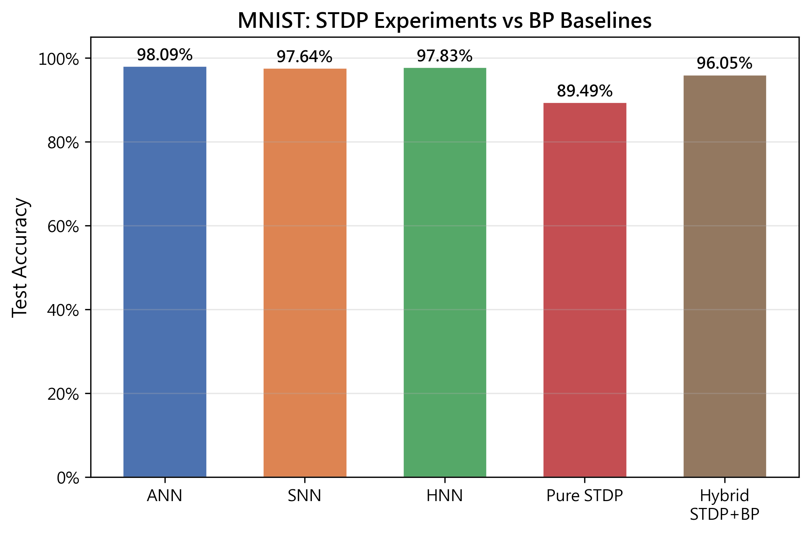
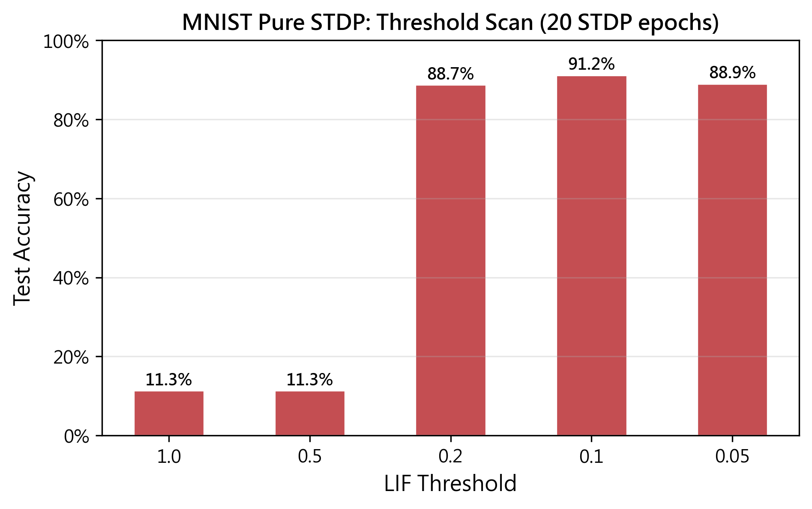
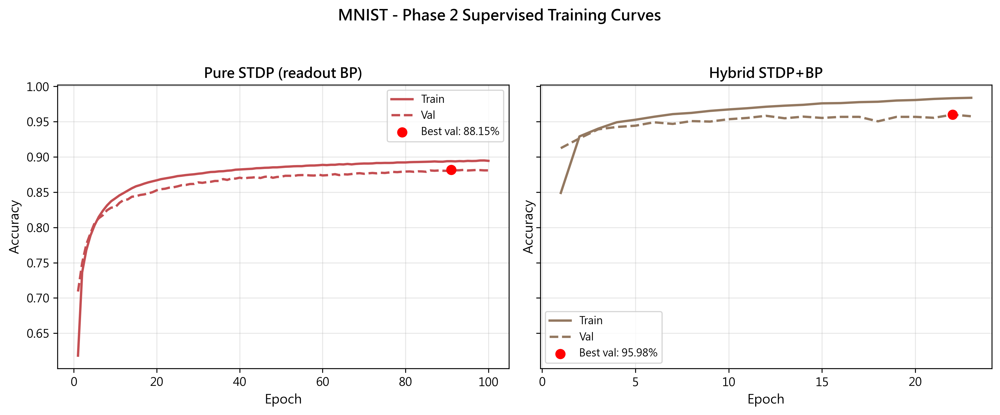

# STDP 實驗報告

## 實驗目標

探討 Spike-Timing-Dependent Plasticity (STDP) 作為無監督特徵學習器在 CIFAR-10 和 MNIST 影像分類上的效果，並與全監督反向傳播 (BP) 的 SNN 基準進行比較。

## 實驗設計

所有模型使用 LeNet-5 架構（兩層卷積 + 兩層全連接），輸入為 TTFS (Time-to-First-Spike) 編碼（時間步 T=10）。

### 實驗 A：純 STDP
- Conv1 和 Conv2：STDP 無監督學習
- Readout（線性分類器）：反向傳播監督學習
- 先進行 STDP 預訓練，再凍結卷積層、訓練 readout

### 實驗 B：混合 STDP+BP
- Conv1：STDP 無監督學習
- Conv2 和全連接層：LIF 神經元 + 代理梯度 BP
- Readout：線性分類器
- Conv1 在 Phase 1 用 STDP 訓練後凍結，其餘層在 Phase 2 用 BP 訓練

### 基準（來自先前實驗）
| 模型 | CIFAR-10 | MNIST |
|------|----------|-------|
| ANN (BP) | 60.77% | 98.09% |
| SNN (BP) | 55.05% | 97.64% |
| HNN (BP) | 60.26% | 97.83% |

---

## CIFAR-10 結果

### 總覽

| 模型 | 測試準確率 | 與 SNN 基準差距 |
|------|-----------|----------------|
| ANN (BP) | 60.77% | +5.72% |
| HNN (BP) | 60.26% | +5.21% |
| SNN (BP) | 55.05% | — |
| **混合 STDP+BP** | **27.08%** | **−27.97%** |
| **純 STDP** | **21.09%** | **−33.96%** |

### 訓練曲線

### CIFAR-10 討論

#### 1. STDP 學到了特徵，但鑑別力有限

純 STDP 模型達到了 21.09%，遠高於隨機猜測（10%），說明 STDP 卷積層確實學到了某些視覺特徵。然而，這些特徵的鑑別力遠不如 BP 學習到的特徵（SNN 55.05%）。

#### 2. 混合模型略優於純 STDP

混合模型（27.08%）比純 STDP（21.09%）高出約 6 個百分點。這是因為混合模型的 Phase 2 中，Conv2 和全連接層仍可用 BP 進行監督微調，部分補償了 Conv1 的 STDP 特徵品質不足。

#### 3. 閾值敏感性

TTFS 編碼的稀疏性使得 STDP 層對 LIF 閾值非常敏感。threshold=1.0 時完全無脈衝（隨機 10%），threshold=0.1 時達到最佳 21.09%。

---

## MNIST 結果

### 總覽

| 模型 | 測試準確率 | 與 SNN 基準差距 |
|------|-----------|----------------|
| ANN (BP) | 98.09% | +0.45% |
| HNN (BP) | 97.83% | +0.19% |
| SNN (BP) | 97.64% | — |
| **混合 STDP+BP** | **96.05%** | **−1.59%** |
| **純 STDP** | **89.49%** | **−8.15%** |

### 閾值掃描

Threshold=0.1 為最佳閾值（91.16%）。Threshold≥0.5 時無脈衝（隨機 11.35%），threshold=0.2 和 0.05 分別為 88.73% 和 88.95%。

### 訓練曲線

### HP 掃描

在 threshold=0.1 下進行超參數掃描（20 STDP epochs）：

| stdp_lr | A_plus | A_minus | 測試準確率 |
|---------|--------|---------|-----------|
| 0.01 | 0.01 | 0.01 | **91.16%** |
| 0.001 | 0.01 | 0.01 | 89.85% |
| 0.1 | 0.01 | 0.01 | 80.45% |
| 0.01 | 0.005 | 0.01 | 11.35% |
| 0.01 | 0.01 | 0.005 | 30.25% |

預設超參數（stdp_lr=0.01, A_plus=A_minus=0.01）表現最佳。A_plus < A_minus 導致淨抑制，A_plus / A_minus 不平衡導致收斂問題。

### MNIST 討論

#### 1. MNIST 上 STDP 表現遠優於 CIFAR-10

純 STDP 在 MNIST 上達到 89.49%，遠高於 CIFAR-10 的 21.09%。主要原因：
- **MNIST 更簡單**：28×28 灰階、筆跡辨識，類別間變異性小
- **輸入通道少**：1 通道 vs 3 通道，STDP 學習的參數空間更小
- **TTFS 編碼效率更高**：MNIST 的黑色背景使 TTFS 脈衝集中在數位區域，時序資訊更有效

#### 2. 混合 STDP+BP 接近 BP 基準

混合模型（96.05%）與 SNN 基準（97.64%）僅差 1.59 個百分點。這表明：
- STDP 初始化的 Conv1 特徵對 MNIST 已足夠好
- Conv2 和全連接層的 BP 微調能有效補償 Conv1 的 STDP 特徵不足
- 在簡單任務上，STDP 可作為 BP 的有效替代或初始化

#### 3. 超參數穩健性

stdp_lr=0.01 為最佳學習率。過高（0.1）導致權重震盪，過低（0.001）則收斂變慢。
A_plus / A_minus 平衡至關重要：A_minus > A_plus 導致權重崩潰。

---

## 綜合討論

### 1. STDP 在簡單任務上有效，在複雜任務上受限

| 指標 | CIFAR-10 | MNIST |
|------|----------|-------|
| 純 STDP | 21.09% | 89.49% |
| 混合 STDP+BP | 27.08% | 96.05% |
| SNN 基準 | 55.05% | 97.64% |
| STDP 與基準差距 | −33.96% | −8.15% |

STDP 在 MNIST 上表現出色（差距僅 8%），但在 CIFAR-10 上差距巨大（34%）。說明 STDP 作為無監督學習器在簡單任務上可行，但無法勝任複雜視覺任務。

### 2. TTFS 編碼與 STDP 的兼容性

TTFS 編碼的稀疏性對 STDP 是雙面刃：
- **優點**：精確的脈衝時序有利於 STDP 的時序依賴性學習
- **缺點**：脈衝太少導致學習機會有限，對 LIF 閾值極度敏感

### 3. 混合架構的潛力

混合 STDP+BP 在兩個資料集上都優於純 STDP，且 MNIST 上接近 BP 基準。這表明 STDP 作為特徵初始化（而非最終學習器）是可行的方向。

### 4. 未來方向

- 使用 rate coding 替代 TTFS 作為 STDP 階段的輸入編碼，增加脈衝密度
- 增加 STDP 訓練 epoch 數
- 對 STDP 參數進行更系統性的搜尋
- 使用更深的 STDP 網路
- 將 STDP 初始化作為 BP 微調的預訓練（而非直接凍結）

## 實驗設定

| 參數 | CIFAR-10 | MNIST |
|------|----------|-------|
| 資料集大小 | 45k/5k/10k | 54k/6k/10k |
| 編碼 | TTFS (T=10) | TTFS (T=10) |
| STDP 超參數 | threshold=0.1, β=0.95, stdp_lr=0.01, A_plus=0.01, A_minus=0.01, τ_pre=10, τ_post=20 |
| Phase 2 超參數 | lr=0.001, batch_size=64, patience=10 |
| 硬體 | RTX 3070 |
