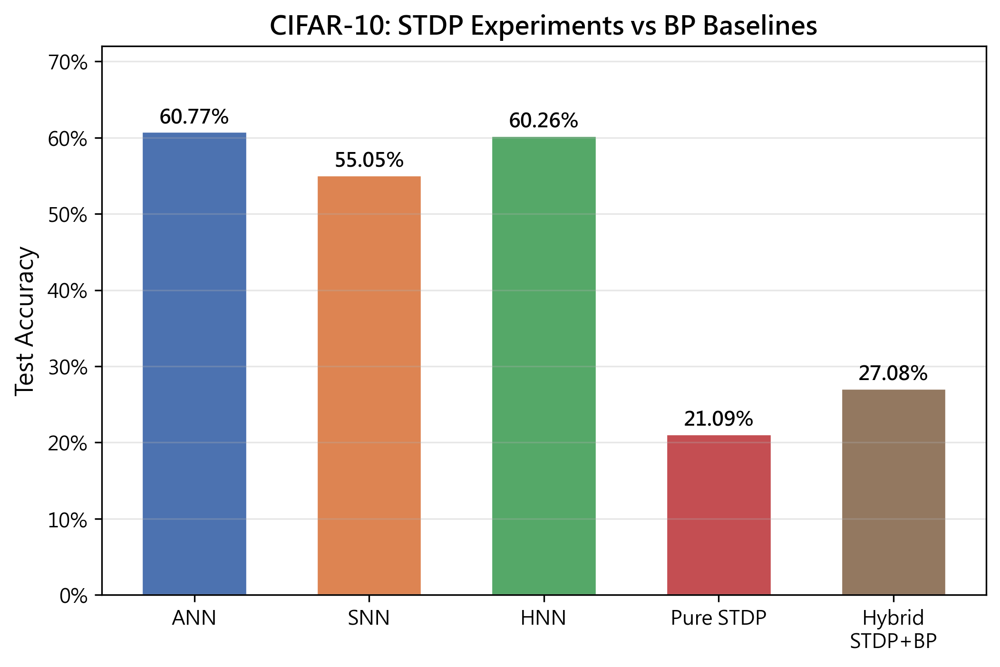
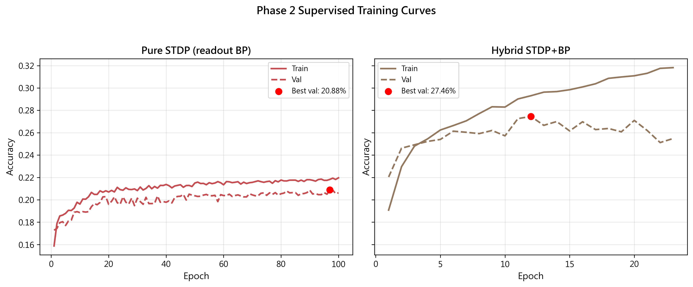

# STDP 實驗報告

## 實驗目標

探討 Spike-Timing-Dependent Plasticity (STDP) 作為無監督特徵學習器在 CIFAR-10 影像分類上的效果，並與全監督反向傳播 (BP) 的 SNN 基準進行比較。

## 實驗設計

所有模型使用 LeNet-5 架構（兩層卷積 + 兩層全連接），輸入為 TTFS (Time-to-First-Spike) 編碼的 CIFAR-10 影像（時間步 T=10）。

### 實驗 A：純 STDP
- Conv1（3→6 通道）和 Conv2（6→16 通道）：STDP 無監督學習
- Readout（線性分類器）：反向傳播監督學習
- 先進行 50 個 epoch 的 STDP 預訓練，再凍結卷積層、訓練 readout

### 實驗 B：混合 STDP+BP
- Conv1（3→6）：STDP 無監督學習（50 epochs）
- Conv2（6→16）和全連接層（120→84）：LIF 神經元 + 代理梯度 BP
- Readout（84→10）：線性分類器
- Conv1 在 Phase 1 用 STDP 訓練後凍結，其餘層在 Phase 2 用 BP 訓練

### 基準（來自先前實驗）
- **ANN CIFAR-10**: 60.77%
- **SNN CIFAR-10**: 55.05%（T=10，threshold=1.0，β=0.95）
- **HNN CIFAR-10**: 60.26%

## 結果

### 總覽

| 模型 | 測試準確率 | 與 SNB 基準差距 |
|------|-----------|----------------|
| ANN (BP) | 60.77% | +5.72% |
| HNN (BP) | 60.26% | +5.21% |
| SNN (BP) | 55.05% | — |
| **混合 STDP+BP** | **27.08%** | **−27.97%** |
| **純 STDP** | **21.09%** | **−33.96%** |

### 訓練曲線

## 討論

### 1. STDP 學到了特徵，但鑑別力有限

純 STDP 模型達到了 21.09%，遠高於隨機猜測（10%），說明 STDP 卷積層確實學到了某些視覺特徵。然而，這些特徵的鑑別力遠不如 BP 學習到的特徵（SNN 55.05%）。

### 2. 混合模型略優於純 STDP

混合模型（27.08%）比純 STDP（21.09%）高出約 6 個百分點。這是因為混合模型的 Phase 2 中，Conv2 和全連接層仍可用 BP 進行監督微調，部分補償了 Conv1 的 STDP 特徵品質不足。

### 3. STDP 與 BP 的巨大差距

兩種 STDP 方法都顯著落後於 BP 基準。主要原因：

- **TTFS 編碼的限制**：每個像素在整個時間序列中最多脈衝一次，突觸前輸入非常稀疏。STDP 的學習機會受限於有限的脈衝時序配對。
- **局部更新 vs 全域梯度**：STDP 僅根據局部脈衝時序調整權重，沒有全域誤差信號引導。相比之下，BP 利用代理梯度從輸出層向後傳播誤差，能更有效地優化所有層。
- **權重初始化和閾值敏感度**：TTFS 輸入的稀疏性使得 STDP 層對 LIF 閾值非常敏感。閾值過高（1.0）導致完全無脈衝，閾值過低（0.1）則使脈衝過於密集，降低時序資訊的資訊量。本實驗使用 threshold=0.1 折衷。

### 4. 未來方向

- 使用 rate coding 替代 TTFS 作為 STDP 階段的輸入編碼，增加脈衝密度
- 增加 STDP 訓練 epoch 數（例如 150-200 epochs）
- 對 STDP 參數（A_plus, A_minus, tau_pre, tau_post）進行系統性搜尋
- 使用更深的 STDP 網路或卷積核大小調整
- 將 STDP 初始化作為 BP 微調的預訓練（而非直接凍結）

## 實驗設定

- **資料集**: CIFAR-10（45k 訓練 / 5k 驗證 / 10k 測試）
- **編碼**: TTFS（T=10）
- **STDP 超參數**: threshold=0.1, β=0.95, stdp_lr=0.1, A_plus=0.01, A_minus=0.01, τ_pre=10, τ_post=20
- **Phase 2 超參數**: lr=0.001, batch_size=64, patience=10
- **硬體**: RTX 3070
